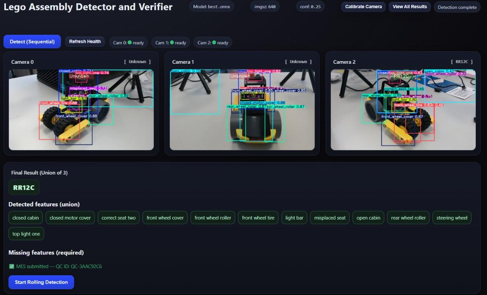

<h1 align="center">AI-Based Assembly Inspection with MES Integration</h1>

<p align="center">
  Real-time LEGO assembly-variant inspection on a Raspberry Pi 5: three USB cameras, a custom YOLOv12s model, and automatic result reporting into a Tulip MES for traceability — all running at the edge.
</p>

<p align="center">
  
  
  
  
  
</p>

<p align="center">
  <a href="#how-it-works">How it works</a> ·
  <a href="#quickstart">Quickstart</a> ·
  <a href="#mes-integration">MES integration</a> ·
  <a href="#troubleshooting">Troubleshooting</a>
</p>

<!-- HERO: replace with a GIF/screenshot of the live detector UI — three camera views with boxes, the resolved variant code, and the MES toast. See asset punch-list. -->
<p align="center">
  
</p>
<p align="center"><em>One of three fixed camera views feeding the inspection pipeline.</em></p>

## Overview

A small LEGO vehicle kit ships in 16 valid build variants, depending on which interchangeable parts are fitted: front and rear wheel type (roller vs. tire), top-light configuration, and seat variant. Telling those variants apart by eye on a line is slow and error-prone, and any result that isn't captured is invisible to the rest of the factory.

This system does it automatically at the station. Three fixed USB cameras each grab a frame; a YOLOv12s model (exported to ONNX) finds assembly features in each view; the features are unioned across all three angles; a deterministic rule set resolves that union into one of 16 variant codes (e.g. `RW21C`) or flags `Unknown` when nothing matches. The result — with timestamps, duration, and per-feature pass/fail — is posted to a Tulip MES table as a new record. Everything but that final POST runs locally on the Pi.

It's a re-implementation and edge port of a Deggendorf Institute of Technology thesis on automated assembly inspection, moving the original laptop-based pipeline onto a Raspberry Pi 5 and wiring it into a live MES.

## How it works

```
   Cam 0          Cam 1          Cam 2
     │              │              │
     ▼              ▼              ▼          sequential open→warm→snap→close
  capture()      capture()      capture()     to avoid USB bus contention
     │              │              │
     ▼              ▼              ▼
        YOLOv12s ONNX inference (per view)
     │              │              │
     └──────────────┴──────────────┘
                    ▼
          union of detected features
                    ▼
       deterministic rule set → variant code
          (Front)(Rear)(Top)(Seat)C
                    ▼
       valid code?  ──No──▶  "Unknown" + missing/ambiguous parts
                    │ Yes
                    ▼
       POST record → Tulip MES table
```

The detector is a Flask app. The browser UI calls `/detect_cam/<idx>` for each camera in turn, posts the combined features to `/classify` for the final code, then auto-submits to the MES via `/send_mes` — no manual confirm step. Capturing one camera at a time (open, warm up, grab, release) is deliberate: opening all three USB webcams at once causes bus contention on the Pi.

## Model & dataset

The detector is a YOLOv12s model trained on a custom 20-class Roboflow dataset ([`legodetect-zaeo9` v13](https://universe.roboflow.com/thesis-0jqhr/legodetect-zaeo9/dataset/13), CC BY 4.0) and exported to ONNX (`best.onnx`). The 20 detection classes are assembly *features* — `closed_cabin`, `front_wheel_roller`, `rear_wheel_tire`, `top_light_one`, `correct_seat_one`, and so on — which the rule set then composes into the 16 variant codes.

> [!NOTE]
> A held-out mAP / accuracy number for the model is not committed to this repo. If you have the YOLOv12s validation metrics from training, add them here — a quality-control classifier is far more convincing to a reader with a real number and the set it was measured on.

## Hardware

| Component | Spec |
|---|---|
| Compute | Raspberry Pi 5 (16 GB RAM) |
| Cameras | 3× Logitech C922 Pro Stream (USB, MJPG @ 1280×720) |
| Model | YOLOv12s → ONNX (`best.onnx`) |
| MES | Tulip (cloud), over HTTPS REST |

## Quickstart

```bash
git clone https://github.com/thelostbong/AI-Based-Automated-Assembly-Inspection-with-MES-Integration.git
cd AI-Based-Automated-Assembly-Inspection-with-MES-Integration

python3 -m venv piyolo
source piyolo/bin/activate
pip install -r requirements.txt

cp .env.example .env        # then fill in camera paths, Tulip URL + API key
python app_onnx_pi.py
```

Then open `http://<pi-ip>:5000/` for the detector, or `/calibrate` for the camera setup page.

Before the first run, map your cameras and sanity-check them:

```bash
ls /dev/video*
python cam_check.py --devices /dev/video0 /dev/video2 /dev/video4
```

This grabs a frame from each device and saves a snapshot, so you can confirm which physical camera is `CAM0` / `CAM1` / `CAM2` in `.env`.

> [!WARNING]
> If your Wi-Fi SSID contains `!` (e.g. `FRITZ!Box`), single-quote it in `nmcli` or the shell will mangle it:
> `sudo nmcli device wifi connect 'FRITZ!Box 7520 LP' password '…'`

## Configuration

All device-specific and secret values live in `.env` (git-ignored). The key ones:

| Variable | Purpose |
|---|---|
| `WEIGHTS_PATH`, `DATA_YAML_PATH` | Absolute paths to `best.onnx` and `data.yaml` |
| `CAM0`, `CAM1`, `CAM2` | Camera device paths — prefer `/dev/v4l/by-id/…` over `/dev/videoN` |
| `IMG_SIZE`, `CONF_THRESHOLD` | YOLO inference size (640) and confidence (0.25) |
| `FRAME_WIDTH/HEIGHT/FPS`, `FOURCC` | Capture settings (1280×720, MJPG) |
| `STATION_ID` | Station identifier reported to Tulip |
| `TULIP_BASE`, `TULIP_AUTH_HEADER`, `TULIP_TABLE_UID` | Tulip endpoint, Basic-auth header, target table |

> [!IMPORTANT]
> Generate your own Tulip API key (Tulip → Settings → API Tokens). Keys are tied to an individual account — don't reuse a teammate's or commit one. Confirm `.env` is in `.gitignore` before your first push, and rotate any key that may have leaked.

## MES integration

Each inspection writes one Tulip record via `tulip_client.py`, containing: station ID; start/end timestamps (UTC RFC3339) and duration; the final variant label or `Unknown`; per-feature booleans (motor cover fixed, roller function, cabin function, light position, tires correct, all parts attached, overall pass/fail); top-light mode and front/rear tire type; and the found/missing feature lists. On success the UI shows an inline status and a toast with the generated record ID (`QC-XXXXXXXX`).

## Repository structure

```
.
├── app_onnx_pi.py     # Main Flask app: capture, YOLO inference, classification, calibration, MES POST
├── cam_check.py       # CLI: probe /dev/video* devices, save a test snapshot per camera
├── cam_control.py     # Standalone MJPEG streaming/zoom test server (dev tool)
├── tulip_client.py    # Tulip REST client + record builder (build_record_from_domain)
├── data.yaml          # 20 YOLO class names + Roboflow dataset reference
├── best.onnx          # Trained YOLOv12s weights (ONNX)  ← see note below
├── templates/         # Flask/Jinja2 UI (detector, calibration, results, rolling)
├── static/            # UI assets + sample camera captures
└── .env.example       # Environment variable template
```

> [!NOTE]
> `best.onnx` is a 36 MB binary committed directly to the repo, which bloats every clone. Move it to a GitHub Release or Git LFS and fetch it during setup instead of tracking it in-tree.

## Camera calibration & diagnostics

- `/calibrate` in the main app streams one camera at a time and adjusts hardware zoom (`v4l2-ctl -c zoom_absolute=…`) with live readback; switching cameras stops the previous stream so only one is ever open.
- `cam_control.py` — standalone server for lower-level camera testing (start/stop capture, software zoom, raw MJPEG stream) independent of the YOLO pipeline.
- `cam_check.py` — one-off CLI check: lists devices and `by-id` symlinks, confirms each opens at the requested resolution/FPS, and saves a snapshot.

## Troubleshooting

<details>
<summary>Field notes from getting this running on Bookworm (click to expand)</summary>

- **Wi-Fi SSIDs with `!`** (e.g. `FRITZ!Box`) silently fail in `nmcli`/bash unless single-quoted.
- **`network-config` on the `bootfs` partition** is only honored on first boot under Bookworm's NetworkManager/cloud-init. Don't patch it live — reflashing the SD card is usually faster.
- **`load_dotenv()` ordering** — call it before any code reads environment variables, or those reads silently fall back to defaults.
- **Flask route order** — `app.run()` must be the last line; any `@app.route` after it never registers.
- **Don't back up the venv by copying it** — copying `piyolo/bin/` across machines loses the symlinks Python needs. Recreate the venv and reinstall after any restore.
- **Hardcoded paths** — some scripts may still reference an older `/home/lego/testapp` path; update them to your actual install path.
- **Backgrounding Flask over SSH** — launch with `&` first if you also want to open a local browser, so the session isn't blocked.

</details>

## Roadmap

- Commit real YOLOv12s validation metrics (mAP, per-class) and a labeled end-to-end accuracy for the 16-variant classification.
- Add a screencast of the live detector + MES submission as the hero visual.
- Move `best.onnx` out of the git tree (Release or LFS).
- Replace inherited Tulip credentials with a personal API key.
- Tune camera warm-up / cooldown timing to shorten the capture cycle.

## License · Acknowledgements · Contact

Released under the MIT License — see [LICENSE](LICENSE). Dataset is CC BY 4.0 (Roboflow `legodetect-zaeo9`).

Accompanies a project at the Deggendorf Institute of Technology. Camera setup, model weights, and Tulip workspace details are specific to the original lab and need adapting for any other deployment.

**Nayeemuddin Mohammed** — M.Sc. Applied AI for Digital Production Management, THD
[GitHub](https://github.com/thelostbong) · [LinkedIn](https://linkedin.com/in/nayeemuddin-mohammed-03/) · nayeemuddin.mohammed@th-deg.de
